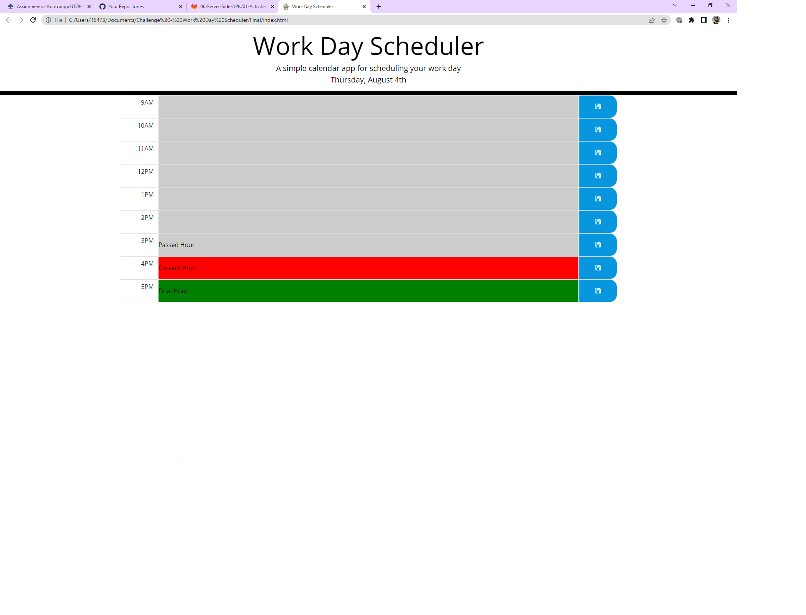

# Title:

 Third-Party APIs: Work Day Scheduler

# About Project:

The purpose of this challenge is to create a calendar application or daily planner that allows users to maintain their important events from their busy schedules during business hours. This app runs in the browser with the help of themed components of HTML, CSS, and JAVASCRIPT and is powered by JQuery.

# Tech:
HTML   
CSS    
JAVASCRIPT

# Additional Resources:
Moment.js     
Bootstrap     
Font Awesome  
JQuery       

# ScreenShots

# Links

Links for your review:

* The URL of the deployed application.
https://asrabilal.github.io/Work-Day-Scheduler/

* The URL of the GitHub repository. 
https://github.com/asrabilal/Work-Day-Scheduler.git

© 2022 Asra Solution Sevices, Inc.
